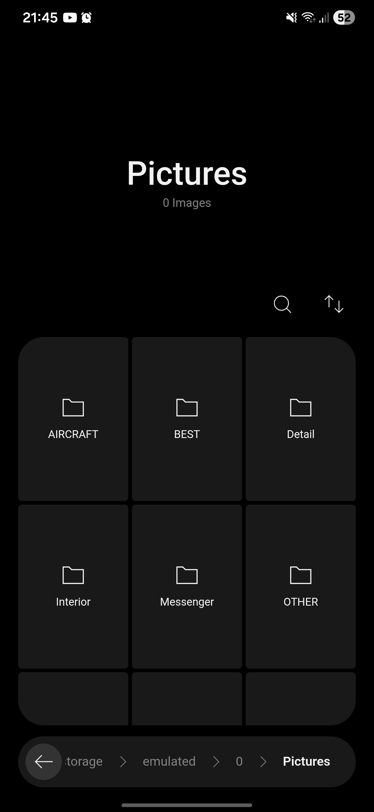
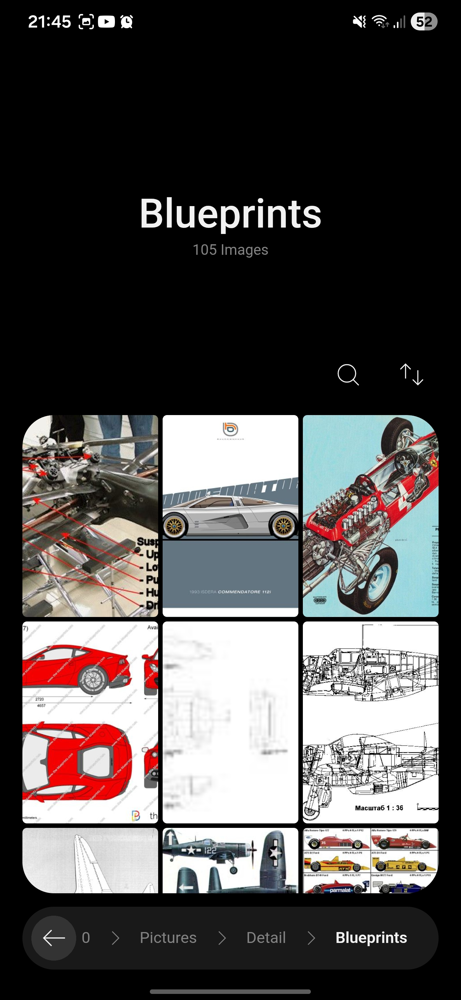
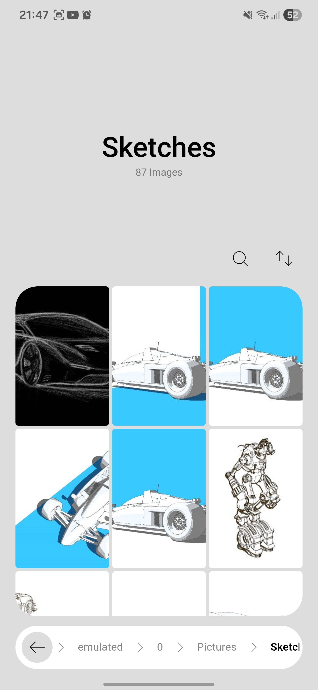
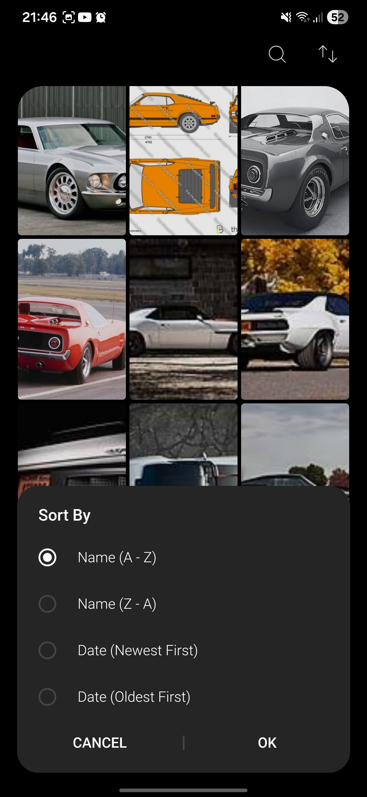
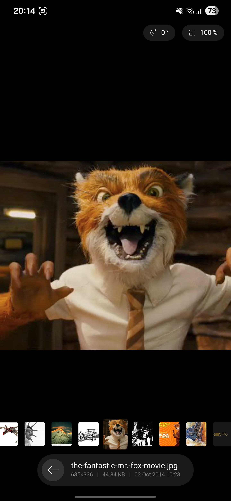
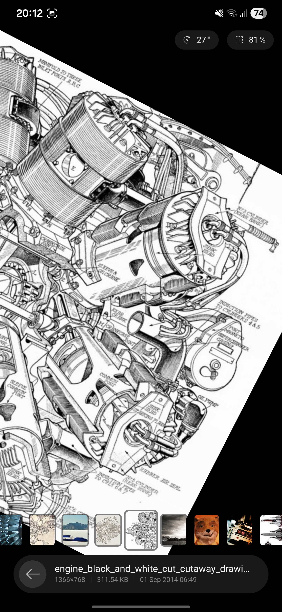

# Minimalist Gallery

A light weight, folder-based clean image gallery built with a combination of Kotlin for the Android native backend and Vanilla JavaScript/HTML/CSS for the frontend.

## Features
- Supports `jpg`, `jpeg`, `png`, `gif`, `bmp`, `webp`, `heic`, `heif`, `svg`, `svgz`, `ico` files
- Built-in folder explorer
- Canvas-like image viewer
- Search

## Thanks
- [Angular Icons](https://angularicons.com/) for the awesome icons.

## Screenshots
|Explorer|Explorer|Light Theme|
|:-:|:-:|:-:|
||||

|Sort By|Viewer|Viewer|
|:-:|:-:|:-:|
||||

## Architecture Overview
The app uses a **Hybrid Architecture**, with a web-based Frontend and a native Android Backend.

### **1. Frontend (WebView)**
Located in `app/src/main/assets`, the UI is built using **Vanilla JavaScript, HTML, and CSS**. It runs inside an Android `WebView`.
- **Foundation** (`app/src/main/assets/foundation`): Contains the core infrastructure for the frontend.
  - `event-bus.js`: The central communication hub that publishes/subscribes to events. It bridges communication with the Android backend.
  - `state.js`: Manages the frontend application state.
  - `html-element-base.js`: A base class for custom web components.

### **2. Backend (Native Android)**
Located in `app/src/main/java/com/minimalist/gallery`, the backend handles heavy lifting like file access, media playback, and system integrations.
- **Foundation** (`.../foundation`):
  - `EventBus.kt`: The native counterpart to the JS EventBus. It receives JSON events from the WebView via a `@JavascriptInterface` and dispatches native events to the UI by injecting JavaScript (`evaluateJavascript`).
  - `Moirai.kt`: A custom threading utility that provides `BG` (Background) and `MAIN` (UI) handlers, replacing Coroutines for detailed control over thread execution.
- **Player** (`.../player`):
  - `PlaybackManager.kt`: A **Foreground Service** responsible for `MediaPlayer` management, audio focus, and handling playback controls (Play, Pause, Seek). It listens to `EventBus` events to control playback.
  - `MediaNotificationManager.kt` & `MediaSessionManager.kt`: Handle system notifications and media session integration (lock screen controls, Bluetooth headsets).

### **3. Communication Bridge**
The app relies on a bidirectional **EventBus** system:
1. **JS to Native**: The WebView calls a global Android interface (e.g., `window.IPC.dispatch(json)`), which routes to `EventBus.kt`.
2. **Native to JS**: `EventBus.kt` constructs a JSON string and executes `window.EventBus.dispatch(event)` in the WebView.
This decoupled design allows the UI to be completely strictly separated from the player logic.

## Installation
1. Clone the repository
2. Open in Android Studio
3. Build and run
